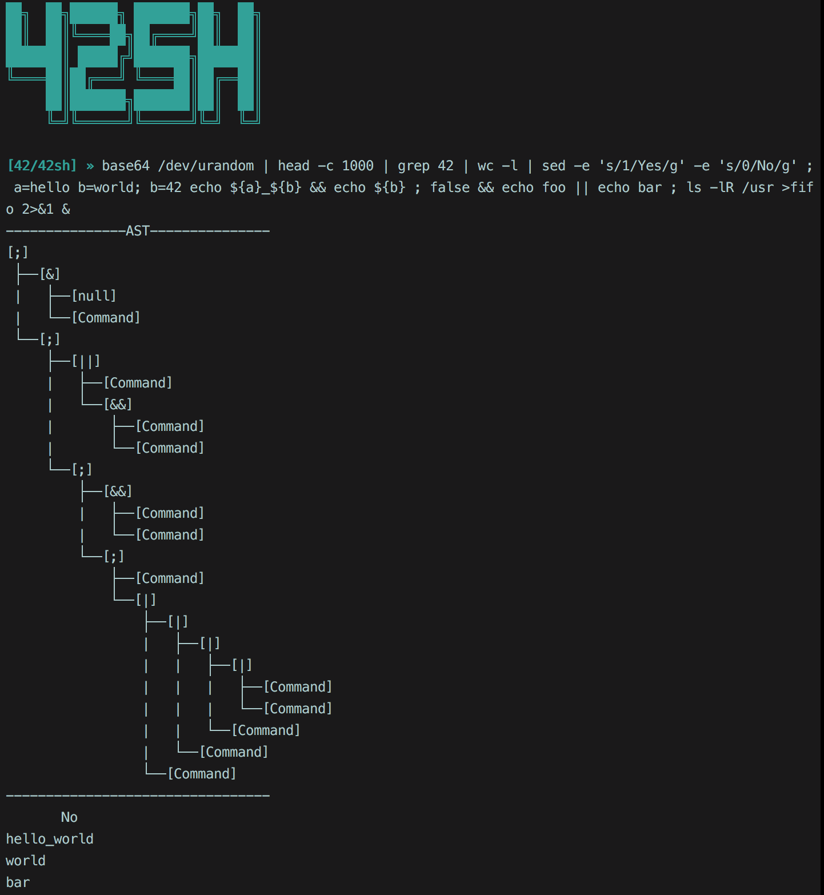

42sh is a complete shell coded from scratch with a couple friends from the 42 school in Paris.  
We only used necessary functions from libraries : (malloc, free, write, dup2, etc.) everything else was coded from scratch, like printf, <string.h> and such.  
No leaks, no crashes. (Satisfied or reimbursed!)

# Usage :

`git clone https://github.com/Hab5/42sh.git && cd 42sh && make && ./42sh`

You can use `./42sh --ast` to see the AST (Abstract Syntax Tree) for each command you type (like in the screenshot above).

# Features :

- Line Edition  
- Builtins  
- Environment gestion  
- Hash Table  
- Job Control  
- Inhibitions  
- Advanced expansion  
- Signals handling  
- Pipe/Redirection/File description aggregation  
- Heredoc
- Iterative search in the history.
- Text Selection
- A lot of other stuff I forgot.


# Bindings

Use of the termcaps library (40 years old, really bad overall, but follows our philosophy of doing everything from scratch, or with really low level functions)

|Binding                         |Effect                        |
|--------------------------------|-----------------------------:|
|`Left/Right`                    |**Move the cursor**               |
|`PgUp/PgDown`                   |**Move the cursor to the next/previous word of the input**|
|`Home/End`                      |**Move the cursor to the the beginning/end of the input**|
|`Backspace`                     |**Delete the previous character from the input**|
|`Delete`                        |**Delete the next character from the input**|
|`Up/Down`                       |**Travel in the history**|
|`Shift+Left/Right`              |**Selection**|
|`Alt+X`                         |**Cut the selection**|
|`Alt+C`                         |**Copy the selection**|
|`Alt+V`                         |**Paste the selection**|
|`Ctrl+R`                        |**Iterative search in the history**|
|`Ctrl+C`                        |**Discard the current input and prompt on a new line**|
|`Ctrl+D`                        |**Exit**|
  
Also handles quote, dquote, backslash, heredoc reprompt. (Inhibition)

# Redirections/Operators
-Redirections/Operators :

`>`, `>>`, `<<`, `<`, `&>`, `>&`, `>&-`, `<&`, `<&-`  
`;` ,`&&`, `||`, `|`, `&`

# Builtins :

`cd`, `echo`, `exit`, `hash`, `type`, `test`, `alias/unalias`, `fc`, `jobs`, `fg`, `bg`, `env`, `setenv`, `unsetenv`, `set`, `unset`, `export`  

All builtins follow the posix norm.

# Cloc :

```
334 text files.
334 unique files.
-------------------------------------------------------------------------------
Language                     files          blank        comment           code
-------------------------------------------------------------------------------
C                              322           1944           3977          14481
C/C++ Header                     9            342            408           1145
make                             2             62             47            400
Markdown                         1             11              0             39
-------------------------------------------------------------------------------
SUM:                           334           2359           4432          16065
-------------------------------------------------------------------------------
```
